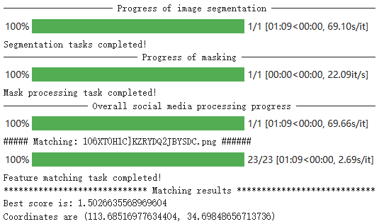

# MIST-SMMD:A Spatio-Temporal Information Extraction Method Based on Multimodal Social Media Data
### [Preprint](https://www.preprints.org/manuscript/202305.1205/v2) | [Paper](https://www.mdpi.com/journal/ijgi)
<br/>

>A spatio-temporal information extraction method based on multimodal social media data: A case study on urban inundation  
>[Yilong Wu](https://github.com/uyoin),  [Yingjie Chen](https://github.com/FalleNSakura2002),[Rongyu Zhang](https://github.com/hz157), [Zhenfei Cui](http://geo.fjnu.edu.cn/main.htm), [Xinyi Liu](http://geo.fjnu.edu.cn/main.htm), [Jiayi Zhang](http://geo.fjnu.edu.cn/main.htm), [Meizhen Wang](http://dky.njnu.edu.cn/info/1213/3986.htm), [Yong Wu](http://geo.fjnu.edu.cn/3e/21/c4964a81441/page.htm)<sup>*</sup>  
> Nodata  

Discussions about the paper are welcomed in the [discussion panel](https://github.com/discussions).



## Colab demo
Want to run MIST-SMMD with custom image pairs without configuring your own GPU environment? Try the Colab demo:
[](https://colab.research.google.com/drive/1BO1gBlShIJn0E0LILbBlghXcaQ85N5XQ?usp=sharing)

## Installation
**Conda:**
```bash
conda env create -f environment.yaml
conda activate mist
```
**Pip:**
``` bash
pip install -r requirements.txt
```
